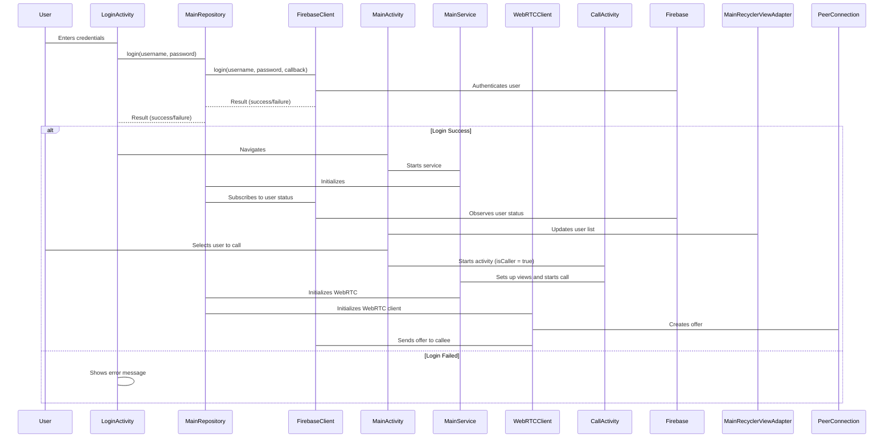

# WebRTCFirebaseVideoCall

This project is a video and audio calling application built for Android using WebRTC for peer-to-peer communication and Firebase for signaling and user authentication. It allows users to log in, view the online status of other users, and initiate video or audio calls. The application also supports features like screen sharing, audio device selection, and camera switching.

## Features

*   **User Authentication:** Implemented using Firebase.
*   **Online Status:** Real-time updates using Firebase Realtime Database.
*   **Video and Audio Calls:** Powered by WebRTC for peer-to-peer communication.
*   **Screen Sharing:** Allows users to share their screen during calls.
*   **Audio Device Selection:** Users can choose between speakerphone and earpiece.
*   **Camera Switching:** Front and back camera options.

## Architecture

The application follows a modular architecture with components for UI, Firebase integration, WebRTC implementation, and service management. Hilt is used for dependency injection, making the codebase more maintainable and testable.



# Stun Server Settings
The application uses a STUN server to discover the public IP address and port of the client, which is necessary for establishing a WebRTC connection. The STUN server settings are located in the WebRTCClient.kt file:

```
// From [app/src/main/java/com/mmk/webrtcfirebasevideocall/webrtc/WebRTCClient.kt](https://github.com/MahabubKarim/WebRTCFirebaseVideoCall/blob/main/app/src/main/java/com/mmk/webrtcfirebasevideocall/webrtc/WebRTCClient.kt)

private val iceServer = listOf(
        // TURN Server, you have to create your own
        /*PeerConnection.IceServer.builder("turn:a.relay.metered.ca:443?transport=tcp")
            .setUsername("83eebabf8b4cce9d5dbcb649")
            .setPassword("2D7JvfkOQtBdYW3R").createIceServer()*/
        // STUN server using your IP Address -> get your IP Address from "https://whatismyipaddress.com/" 
        // Don't forget to use same Network for both mobile devices.
        PeerConnection.IceServer.builder("stun:${BuildConfig.MY_IP_ADDRESS}:3478")
            .createIceServer()
    )
```
The stun:\${BuildConfig.MY_IP_ADDRESS}:3478 is used in this project.

Note:  You can replace the stun:${BuildConfig.MY_IP_ADDRESS}:3478 server with other public STUN servers.  It's crucial to ensure that the STUN server is reliable for the application to function correctly.

