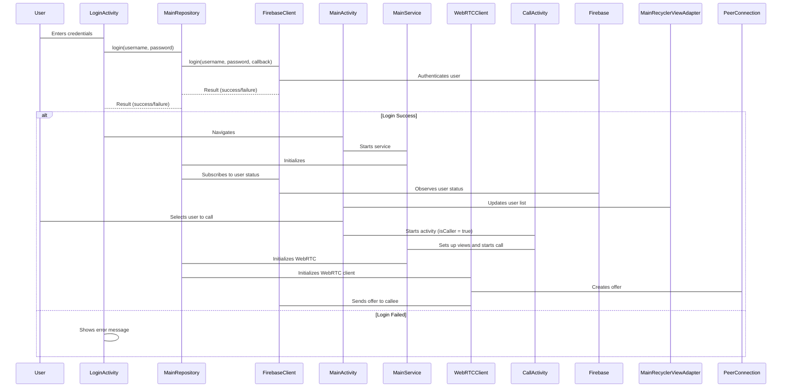

# WebRTCFirebaseVideoCall

This project is a video and audio calling application built for Android using WebRTC for peer-to-peer communication and Firebase for signaling and user authentication. It allows users to log in, view the online status of other users, and initiate video or audio calls. The application also supports features like screen sharing, audio device selection, and camera switching.

## Features

*   **User Authentication:** Implemented using Firebase.
*   **Online Status:** Real-time updates using Firebase Realtime Database.
*   **Video and Audio Calls:** Powered by WebRTC for peer-to-peer communication.
*   **Screen Sharing:** Allows users to share their screen during calls.
*   **Audio Device Selection:** Users can choose between speakerphone and earpiece.
*   **Camera Switching:** Front and back camera options.

## Architecture

The application follows a modular architecture with components for UI, Firebase integration, WebRTC implementation, and service management. Hilt is used for dependency injection, making the codebase more maintainable and testable.



```
  ┌──────────────┐                ┌──────────────┐
  │    Caller    │                │   Callee     │
  └─────┬────────┘                └─────┬────────┘
        │                                 │
        │ 1. Create Offer (SDP)           │
        ├────────────────────────────────>│
        │                                 │
        │ 2. Set Local Description         │
        │                                 │
        │                3. Set Remote Description
        │<────────────────────────────────┤
        │                                 │
        │                4. Create Answer (SDP)
        │<────────────────────────────────┤
        │                                 │
        │ 5. Set Remote Description        │
        ├────────────────────────────────>│
        │                                 │
        ▼                                 ▼
 ┌────────────────────┐          ┌────────────────────┐
 │ Use STUN to get    │          │ Use STUN to get    │
 │ public IP (SRFLX)  │          │ public IP (SRFLX)  │
 └────────────────────┘          └────────────────────┘
        │                                 │
        │ 6. Send ICE Candidates          │
        ├────────────────────────────────>│
        │<────────────────────────────────┤
        │                                 │
        │ 7. Test Connectivity with ICE   │
        │    Candidate Pairs (ICE checks) │
        │                                 │
        │   ✓ Select best working route   │
        │         (e.g. SRFLX ↔ Host)     │
        ▼                                 ▼
      🔗 P2P Connection Established (Media/Data Flow)
```

# Firebase Integration
This application uses Firebase for user authentication and managing user status in Realtime Database.

## google-services.json
The google-services.json file is essential for connecting your Android app to your Firebase project. It contains important configuration details like your project's API keys and IDs. To obtain this file:

* Go to the [Firebase Console](https://console.firebase.google.com/u/0/).
* Select your project. If you don't have a project, create one.
* Click on the Android icon to add your app.
* Follow the instructions to register your app and download the google-services.json file.
* Place the google-services.json file in the app/ directory of your Android project.
* Firebase Realtime Database Setup
* Firebase Realtime Database is used to store and synchronize data in real-time. Here’s how it's set up in this project:

## Dependencies:
Ensure that the Firebase Realtime Database KTX library is included in your build.gradle.kts file:

```
dependencies {
    implementation(platform(libs.firebase.bom))
    implementation(libs.firebase.database.ktx)
}
```

Also, make sure that you have the google-services plugin

```
plugins {
    id("com.google.gms.google-services")
}
```

## Database URL:
The Firebase Realtime Database URL is configured in the BuildConfig.java file during the build process. You need to define FIREBASE_REALTIME_DATABASE_URL in your build.gradle file:

```
android {
    defaultConfig {
        buildConfigField("String", "FIREBASE_REALTIME_DATABASE_URL", "\"YOUR_FIREBASE_REALTIME_DATABASE_URL\"")
    }
}
```
To get your Firebase Realtime Database URL:

* Go to the [Firebase Console](https://console.firebase.google.com/u/0/).
* Select your project.
* Navigate to "Realtime Database" in the left sidebar.
* Find your database URL, which looks like https://YOUR_PROJECT_ID.firebaseio.com.
* Database Instance:
  The database instance is initialized using the URL from BuildConfig:
  
```
// From [app/src/main/java/com/mmk/webrtcfirebasevideocall/di/AppModule.kt](https://github.com/MahabubKarim/WebRTCFirebaseVideoCall/blob/main/app/src/main/java/com/mmk/webrtcfirebasevideocall/di/AppModule.kt)
@Provides
@Singleton
fun provideDataBaseInstance():FirebaseDatabase = FirebaseDatabase
    .getInstance(BuildConfig.FIREBASE_REALTIME_DATABASE_URL)

@Provides
@Singleton
fun provideDatabaseReference(db:FirebaseDatabase): DatabaseReference = db.reference
```

## Data Structure:
The database stores user information, including their status (ONLINE, OFFLINE, IN_CALL), password, and the latest event (used for signaling):

```
{
  "users": {
    "username1": {
      "status": "ONLINE",
      "password": "password123",
      "latest_event": { ... }
    },
    "username2": {
      "status": "OFFLINE",
      "password": "securePassword",
      "latest_event": null
    },
    ...
  }
}
```

# Stun Server Settings
The application uses a STUN server to discover the public IP address and port of the client, which is necessary for establishing a WebRTC connection. The STUN server settings are located in the WebRTCClient.kt file:

```
// From [app/src/main/java/com/mmk/webrtcfirebasevideocall/webrtc/WebRTCClient.kt](https://github.com/MahabubKarim/WebRTCFirebaseVideoCall/blob/main/app/src/main/java/com/mmk/webrtcfirebasevideocall/webrtc/WebRTCClient.kt)

private val iceServer = listOf(
        // TURN Server, you have to create your own
        /*PeerConnection.IceServer.builder("turn:a.relay.metered.ca:443?transport=tcp")
            .setUsername("83eebabf8b4cce9d5dbcb649")
            .setPassword("2D7JvfkOQtBdYW3R").createIceServer()*/
        // STUN server using your IP Address -> get your IP Address from "https://whatismyipaddress.com/" 
        // Don't forget to use same Network for both mobile devices.
        PeerConnection.IceServer.builder("stun:${BuildConfig.MY_IP_ADDRESS}:3478")
            .createIceServer()
    )
```
The stun:\${BuildConfig.MY_IP_ADDRESS}:3478 is used in this project.

Note:  You can replace the stun:${BuildConfig.MY_IP_ADDRESS}:3478 server with other public STUN servers.  It's crucial to ensure that the STUN server is reliable for the application to function correctly.

Special Thanks to [CodingWithKael](https://www.youtube.com/@codewithkael)
